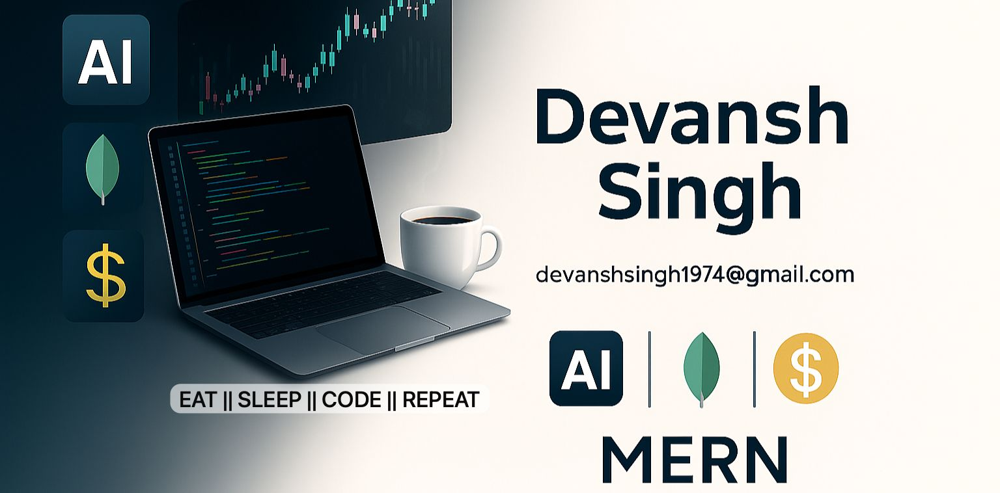

<!-- Intro Section -->
<h1 align="center" style="font-size: 2.8em;">
  Hi, I'm 
  <a href="https://www.linkedin.com/in/devanshsingh2006/" target="_blank" style="color:#FF6EC7; text-decoration:none;">
    DEVANSH SINGH
  </a>
  
</h1>

  🚀 Full Stack Developer | 🤖 AI Enthusiast | 💡 Problem Solver  
  Building creative, scalable, and impactful tech solutions.

<!-- Rainbow Typing Animation -->

  

---

## 🚀 About Me  
I’m **Devansh Singh**, a passionate **Full Stack Web Developer** and **AI Enthusiast** who loves crafting ideas into impactful digital experiences.  
- 💻 Expert in **MERN Stack** & modern frameworks like **Next.js**  
- 🤖 Exploring the world of **Machine Learning** & automation tools  
- 🎯 Focused on **scalable, creative, and high-performance** applications  
- 🌱 Always learning, building, and sharing with the community  

📬 **Let’s Connect:** [LinkedIn](https://www.linkedin.com/in/devanshsingh2006/) | [Portfolio](https://yourportfolio.com)

---

## 🚀 Currently Building

| Project | Tech Stack |
|---------|------------|
| **StockBeacon** – Finance & stock analysis platform with AI insights. [🔗 GitHub](https://github.com/Devansh1974/S69_Devansh_Capstone_StockBeacon) |    |
| **FOREVER – Ecommerce Platform** – MERN stack store with admin dashboard. [🔗 GitHub](https://github.com/Devansh1974/e-commerce-forever) |     |

---

## 🌟 Featured Projects

| Project | Tech Stack |
|---------|------------|
| **Chatty – Full Stack Chat App** – Real-time messaging with Socket.io. [🔗 Live](https://chatty-onlinechattingapp.onrender.com/) \| [🔗 GitHub](https://github.com/Devansh1974/chat_app_fullstack) |    |
| **Dev AI Bot** – AI-powered assistant for intelligent automation. [🔗 Live](https://dev-ai-bot.netlify.app/) \| [🔗 GitHub](https://github.com/Devansh1974/Dev_AI_Bot) |   |
| **MCP Twitter Post Tool** – Auto-generate & post tweets using MCP Server + Gemini AI. [🔗 GitHub](https://github.com/Devansh1974/MCP_AI_Server_Agent) |   |
| **Weather App** – Location-based forecasts using OpenWeather API. [🔗 GitHub](https://github.com/Devansh1974/Weather-App) |   |

---

## 🚀 Currently Building

- **StockBeacon** – Finance & stock analysis platform with AI insights.  
   
   
    
  🔗 [GitHub](https://github.com/Devansh1974/S69_Devansh_Capstone_StockBeacon)

- **FOREVER – Ecommerce Platform** – MERN stack store with admin dashboard.  
   
   
   
    
  🔗 [GitHub](https://github.com/Devansh1974/e-commerce-forever)

---

## 🌟 Featured Projects

- **Chatty – Full Stack Chat App** – Real-time messaging with Socket.io.  
   
   
    
  🔗 [Live](https://chatty-onlinechattingapp.onrender.com/) | [GitHub](https://github.com/Devansh1974/chat_app_fullstack)

- **Dev AI Bot** – AI-powered assistant for intelligent automation.  
   
    
  🔗 [Live](https://dev-ai-bot.netlify.app/) | [GitHub](https://github.com/Devansh1974/Dev_AI_Bot)

- **MCP Twitter Post Tool** – Auto-generate & post tweets using MCP Server + Gemini AI.  
   
    
  🔗 [GitHub](https://github.com/Devansh1974/MCP_AI_Server_Agent)

- **Weather App** – Location-based forecasts using OpenWeather API.  
   
    
  🔗 [Live](https://check-weather11.netlify.app/) | [GitHub](https://github.com/Devansh1974/Weather-App)

Let's Connect & Create something amazing for the World ! 🚀

  

## 🌐 Socials:

  
  <!-- Networking & Social -->
  
  
  
  
    
  
  <!-- Coding Profiles -->
  
  
  

# 💻 Tech Stack

---

## 🎨 Frontend & UI/UX  
|  |  |  |  |  |
|------|------|------|------|------|
|  |  |  |  |  |

---

## 🛠 Backend & Databases  
|  |  |  |  |  |
|------|------|------|------|------|

---

## ⚙️ DevOps & Tools  
|  |  |  |  |  |
|------|------|------|------|------|
|  |  |  |  |  |

---

## ☁️ Cloud & Deployment  
|  |  |  |  |  |
|------|------|------|------|------|

---

## 🤖 AI/ML & Data Science  
|  |  |  |  |  |
|------|------|------|------|------|

---

## 🛠 Other Skills  
|  |  |  |  |  |
|------|------|------|------|------|

---
## 📊 GitHub Stats & Trophies

  <!-- Stats and Most Used Languages Side by Side -->
  <table>
    <tr>
      <td></td>
      <td></td>
    </tr>
  </table>

  <!-- Trophies Section -->
  <h2>🏆 GitHub Trophies</h2>
  

  <!-- Contribution Streak Graph -->
  <h2>🔥 Contribution Graph</h2>
  

---

<picture>
  <source media="(prefers-color-scheme: dark)" srcset="https://raw.githubusercontent.com/Devansh1974/Devansh1974/output/github-snake-dark.svg" />
  <source media="(prefers-color-scheme: light)" srcset="https://raw.githubusercontent.com/Devansh1974/Devansh1974/output/github-snake.svg" />
  
</picture>